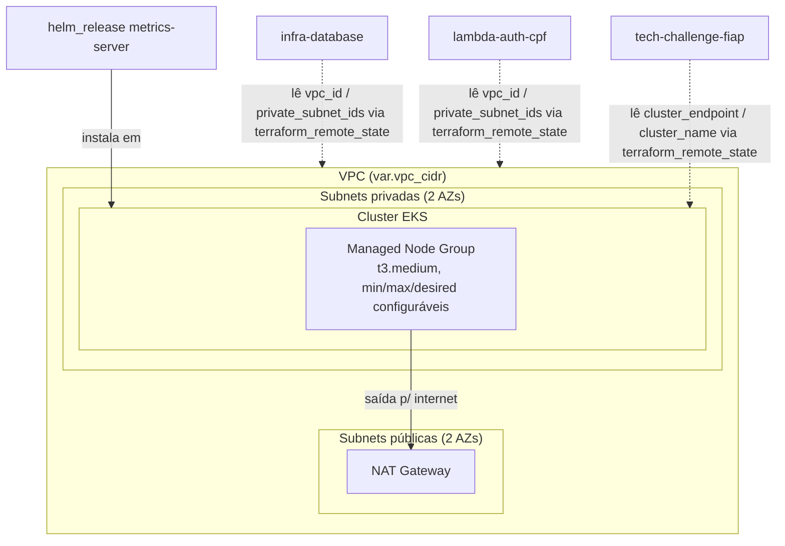

# infra-kubernetes

Provisiona a rede (VPC) e o cluster Kubernetes gerenciado (EKS) na AWS que hospeda a aplicação Laravel do Tech Challenge Fase 3, via Terraform.

## Arquitetura



Este repositório é a base: os outros três (`infra-database-fiap`, `lambda-auth-cpf-fiap` e
`tech-challenge-fiap`) leem os outputs daqui via `terraform_remote_state` — por isso ele precisa ser
aplicado primeiro.

## O que este repositório cria

- VPC dedicada com subnets públicas e privadas em 2 AZs, NAT Gateway.
- Cluster EKS com um managed node group (autoscaling entre `node_min_size` e `node_max_size`).
- `metrics-server` via Helm, necessário para o HPA da aplicação Laravel.
- Addons gerenciados do EKS: CoreDNS, kube-proxy, VPC CNI. (Sem EBS CSI driver: como o MySQL virou
  RDS — ver `infra-database-fiap` —, não sobra nenhum PersistentVolume dentro do cluster que precise
  dele.)

## O que este repositório NÃO cria

- Os manifests da aplicação Laravel em si (Deployment, Service, HPA, ConfigMap, Secret) — isso continua no repositório da aplicação, só que agora `terraform apply` roda contra este cluster EKS em vez do Minikube.
- O banco de dados — fica no repositório `infra-database` (RDS), que consome `vpc_id` e `private_subnet_ids` daqui via `terraform_remote_state` ou `data "terraform_remote_state"`.
- API Gateway e Lambda de autenticação — ficam no repositório `lambda-auth-cpf`.

## Pré-requisitos

- Terraform >= 1.6
- Credenciais AWS com permissão para criar VPC, EKS, IAM roles
- Um bucket S3 + tabela DynamoDB para o backend remoto do state (criar manualmente uma vez, fora deste repositório, ou num repositório `bootstrap` à parte)

## Uso local

> Se você está rodando isso num **AWS Academy Learner Lab**, siga primeiro o [`AWS_ACADEMY.md`](./AWS_ACADEMY.md) — tem os passos específicos pra pegar credenciais temporárias e o ARN da `LabRole`.

```bash
terraform init \
  -backend-config="bucket=SEU_BUCKET" \
  -backend-config="key=infra-kubernetes/terraform.tfstate" \
  -backend-config="region=us-east-1" \
  -backend-config="dynamodb_table=SUA_TABELA_LOCK"

terraform plan
terraform apply
```

## CI/CD

O workflow `.github/workflows/terraform.yml` roda `terraform plan` em todo Pull Request. O `apply` é disparado manualmente (`workflow_dispatch`), porque no AWS Academy as credenciais são temporárias (expiram em poucas horas) e precisam ser atualizadas nos secrets do repositório a cada sessão nova do Lab — não dá pra automatizar via OIDC como seria numa conta AWS normal.

Secrets necessários no repositório:
- `AWS_ACCESS_KEY_ID`, `AWS_SECRET_ACCESS_KEY`, `AWS_SESSION_TOKEN` — copiados do bloco "AWS Details" do Learner Lab, atualizados a cada sessão
- `TF_STATE_BUCKET`
- `TF_LOCK_TABLE`

Se/quando migrar para uma conta AWS normal (fora do Academy), dá pra trocar para autenticação via OIDC (sem secret fixo) e voltar o `apply` para automático no merge da `main` — nesse caso também dá pra ligar `enable_irsa`, `create_kms_key` e deixar o Terraform criar as roles IAM (`create_iam_role = true`) em vez de reusar a `LabRole`.
